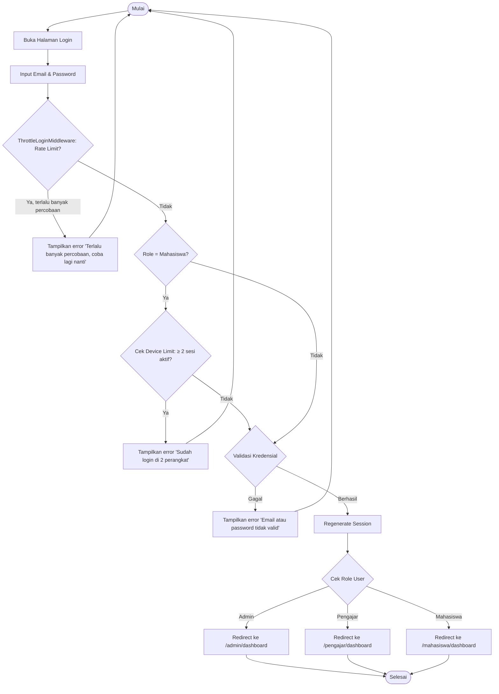
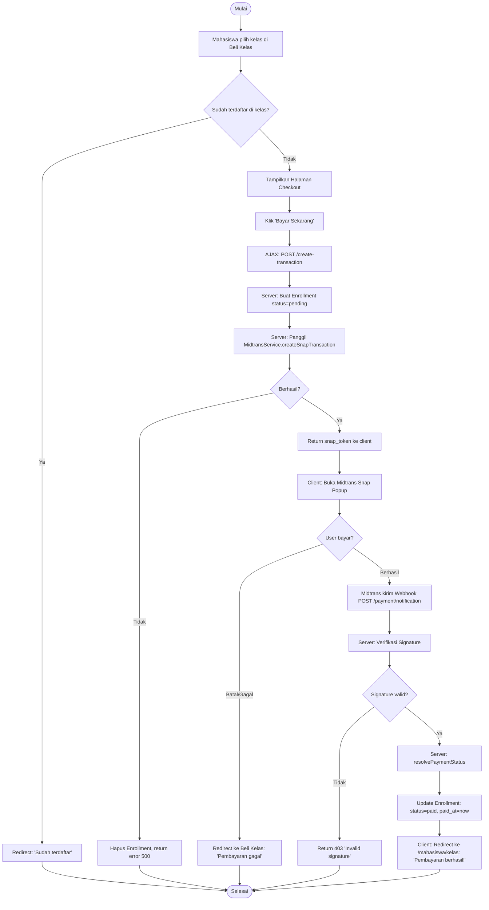
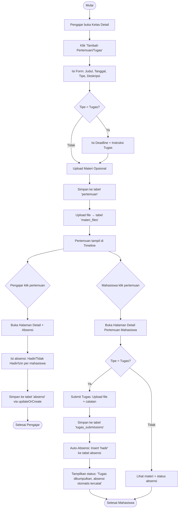
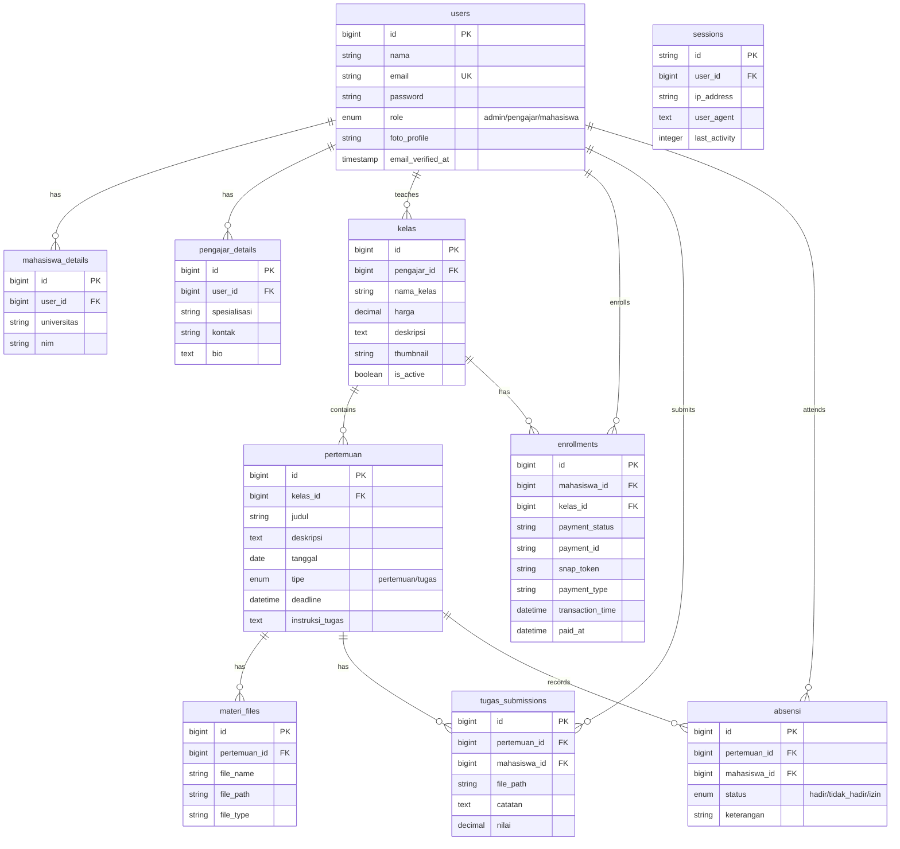

# LAPORAN KERJA PRAKTEK

## Perancangan dan Implementasi Sistem Learning Management System (LMS) Berbasis Laravel dengan Fitur Scheduling dan Payment Gateway

---

**Disusun oleh:**
**Jack Vito Malumbot**
**411231165**

PROGRAM STUDI TEKNIK INFORMATIKA
FAKULTAS TEKNIK DAN INFORMATIKA
UNIVERSITAS DIAN NUSANTARA
JAKARTA
01 APRIL 2026

---

## HALAMAN PENGESAHAN

| | |
|---|---|
| **Nama Mahasiswa** | Jack Vito Malumbot |
| **NIM Mahasiswa** | 411231165 |
| **Judul KP** | Perancangan dan Implementasi Sistem Learning Management System (LMS) Berbasis Laravel dengan Fitur Scheduling dan Payment Gateway |
| **Periode Kerja Praktek** | Maret 2026 s.d Juli 2026 |
| **Nama Perusahaan/Institusi** | Sobat Medis |
| **Alamat Perusahaan/Institusi** | Jl. Rawa Kepa V No.729, Rt.9/Rw.15, Tomang, Kec. Grogol Petamburan, Kota Jakarta Barat, DKI Jakarta 11440 |
| **Nomor Telepon** | 085765251316 |
| **Nama Pembimbing Lapangan** | Timotius Andrijun |
| **Jabatan Pembimbing Lapangan** | Pengajar Kelas Sobat Medis |
| **Telepon Pembimbing Lapangan** | 085150715816 |
| **Nama Dosen Pembimbing** | Anita Ratnasari, S.Kom., M.Kom. |
| **Email Dosen Pembimbing** | Anita.ratnasari@dosen.undira.ac.id |

Telah disetujui dan disahkan pada tanggal, bulan dan tahun sidang.

**Pembimbing Kerja Praktek Industri**

\_\_\_\_\_\_\_\_\_\_\_\_\_\_\_\_\_\_\_\_\_\_\_\_\_\_\_\_\_\_
Timotius Andrijun — Pengajar

**Dosen Pembimbing Kerja Praktek**

\_\_\_\_\_\_\_\_\_\_\_\_\_\_\_\_\_\_\_\_\_\_\_\_\_\_\_\_\_\_
Anita Ratnasari, S.Kom., M.Kom. — NIK/NIP. 11038101240055

**Mengetahui, Ketua Program Studi Teknik Informatika**

\_\_\_\_\_\_\_\_\_\_\_\_\_\_\_\_\_\_\_\_\_\_\_\_\_\_\_\_\_\_
Anita Ratnasari, S.Kom., M.Kom. — NIK/NIP. 11038101240055

---

## KATA PENGANTAR

Puji syukur penulis panjatkan ke hadirat Tuhan Yang Maha Esa atas rahmat dan karunia-Nya, sehingga penulis dapat menyelesaikan laporan Kerja Praktek ini tepat pada waktunya. Laporan ini disusun berdasarkan kegiatan Kerja Praktek yang dilaksanakan di Sobat Medis selama periode 01 Mei 2026.

Penulisan laporan ini bertujuan untuk memenuhi syarat kelulusan mata kuliah Kerja Praktek pada Program Studi Teknik Informatika, Fakultas Teknik dan Informatika, Universitas Dian Nusantara. Selain itu, laporan ini diharapkan dapat memberikan gambaran mengenai penerapan ilmu Software Engineering di dunia industri.

Dalam pelaksanaan Kerja Praktek dan penyusunan laporan ini, penulis menyadari masih terdapat berbagai kendala dan kekurangan, baik dari segi teknis maupun materi yang disajikan. Namun, berkat bantuan dan dukungan dari berbagai pihak, kendala tersebut dapat teratasi dengan baik.

Oleh karena itu, pada kesempatan ini penulis ingin menyampaikan ucapan terima kasih kepada:

1. Bapak/Ibu Anita Ratnasari, S.Kom., M.Kom., selaku Dosen Pembimbing yang telah memberikan arahan dan bimbingan selama penyusunan laporan ini.
2. Bapak Timotius Andrijun selaku Pembimbing Lapangan di Sobat Medis atas ilmu dan bimbingan praktis yang diberikan selama masa Kerja Praktek.
3. Seluruh staf dan karyawan Sobat Medis yang telah membantu kelancaran kegiatan selama di lapangan.
4. Keluarga dan rekan-rekan mahasiswa Teknik Informatika yang selalu memberikan dukungan moral.

Penulis berharap laporan ini dapat memberikan manfaat bagi pembaca, khususnya bagi rekan-rekan mahasiswa Universitas Dian Nusantara. Kritik dan saran yang membangun sangat penulis harapkan demi kesempurnaan laporan ini di masa mendatang.

Jakarta, 01 Mei 2026

(TTD)
**Jack Vito Malumbot** — NIM: 411231165

---

## ABSTRAK

*Kegiatan magang ini bertujuan untuk merancang dan mengimplementasikan sistem Learning Management System (LMS) berbasis web yang dapat memfasilitasi proses pembelajaran secara efektif antara pengajar dan mahasiswa. Sistem dikembangkan menggunakan framework Laravel dengan mengintegrasikan fitur scheduling untuk pengaturan jadwal pertemuan kelas serta payment gateway untuk mengotomatisasi proses pembayaran setiap sesi pembelajaran. Pengembangan sistem dilakukan dengan pendekatan analisis kebutuhan, perancangan sistem, implementasi, dan pengujian guna memastikan seluruh fitur berjalan sesuai dengan kebutuhan pengguna.*

*Hasil dari kegiatan magang ini adalah sebuah aplikasi LMS yang mampu mengelola aktivitas pembelajaran secara terintegrasi, mulai dari penjadwalan kelas, manajemen pengguna, hingga proses transaksi pembayaran yang dilakukan secara otomatis dan aman. Fitur scheduling membantu pengajar dan mahasiswa dalam mengatur jadwal pertemuan secara lebih terstruktur, sedangkan integrasi payment gateway meningkatkan efisiensi pengelolaan pembayaran tanpa memerlukan proses verifikasi manual. Dengan adanya sistem ini, proses administrasi dan pelaksanaan pembelajaran menjadi lebih efektif, transparan, dan mudah diakses melalui platform berbasis web.*

**Kata kunci:** *Learning Management System (LMS), Laravel, Scheduling, Payment Gateway, Sistem Pembelajaran Online.*

---

## DAFTAR ISI

- LAPORAN KERJA PRAKTEK
- HALAMAN PENGESAHAN — i
- KATA PENGANTAR — ii
- ABSTRAK — iii
- DAFTAR ISI — iv
- DAFTAR GAMBAR — v
- DAFTAR TABEL — vi
- BAB 1. PENDAHULUAN — 1
- BAB 2. GAMBARAN UMUM PERUSAHAAN — 4
- BAB 3. KEGIATAN KERJA PRAKTEK — 6
- BAB 4. HASIL DAN PEMBELAJARAN TEKNIS — 12
  - 4.1 Hasil Pekerjaan — 12
  - 4.2 Penjelasan Teknis — 14
  - 4.3 Kendala dan Solusi — 30
  - 4.4 Analisis dan Evaluasi — 32
  - 4.5 Pembelajaran yang Diperoleh — 33
- BAB 5. PENUTUP — 35
  - 5.1 Kesimpulan — 35
  - 5.2 Saran — 36
- DAFTAR PUSTAKA — 37
- LAMPIRAN — 38

---

## DAFTAR GAMBAR

- Gambar 4.1 Arsitektur Sistem SobatMedis (Client-Server Monolith)
- Gambar 4.2 Use Case Diagram SobatMedis
- Gambar 4.3 Activity Diagram Proses Login dengan Role-Based Redirect
- Gambar 4.4 Activity Diagram Proses Pembayaran Kelas via Midtrans
- Gambar 4.5 Activity Diagram Penjadwalan Pertemuan dan Absensi
- Gambar 4.6 Entity Relationship Diagram (ERD) Database SobatMedis
- Gambar 4.7 Tampilan Halaman Landing Page
- Gambar 4.8 Tampilan Halaman Login
- Gambar 4.9 Tampilan Dashboard Pengajar
- Gambar 4.10 Tampilan Dashboard Mahasiswa
- Gambar 4.11 Tampilan Halaman Checkout (Midtrans Snap)
- Gambar 4.12 Tampilan Halaman Absensi Pengajar
- Gambar 4.13 Tampilan Rekap Absensi PDF

---

## DAFTAR TABEL

- Tabel 1 Timeline Pekerjaan Kerja Praktek
- Tabel 2 Tools dan Teknologi yang Digunakan
- Tabel 3 Spesifikasi Basis Data (10 Tabel)
- Tabel 4 Daftar Route API/Web (55+ routes)
- Tabel 5 Hasil Pengujian White-Box — Modul Autentikasi
- Tabel 6 Hasil Pengujian White-Box — Modul Pembayaran
- Tabel 7 Hasil Pengujian White-Box — Modul Absensi

---

## BAB 1. PENDAHULUAN

### 1.1 Latar Belakang

Perkembangan teknologi informasi di bidang pendidikan telah mendorong transformasi dari metode pembelajaran konvensional menuju model pembelajaran berbasis digital. Salah satu implementasi yang paling relevan adalah Learning Management System (LMS), yaitu platform yang memfasilitasi kegiatan belajar-mengajar secara terintegrasi melalui media web. Di bidang kedokteran dan kesehatan, kebutuhan akan platform pembelajaran yang terstruktur, dapat diakses kapan saja, serta dilengkapi fitur manajemen kelas dan transaksi keuangan menjadi semakin mendesak.

Sobat Medis merupakan lembaga yang bergerak di bidang edukasi medis yang menghubungkan mahasiswa kedokteran dan kesehatan dengan pengajar profesional. Sebelumnya, proses administrasi pembelajaran, penjadwalan pertemuan, dan pengelolaan pembayaran masih dilakukan secara manual, sehingga menimbulkan berbagai kendala dari segi efisiensi dan transparansi. Berdasarkan kondisi tersebut, penulis memilih Sobat Medis sebagai tempat Kerja Praktek karena kebutuhannya sangat relevan dengan kompetensi di bidang Teknik Informatika, khususnya pengembangan aplikasi web (Software Engineering).

Selama pelaksanaan Kerja Praktek, penulis ditugaskan untuk merancang dan mengimplementasikan sebuah sistem LMS berbasis Laravel yang mencakup fitur scheduling (penjadwalan pertemuan/tugas), payment gateway terintegrasi (Midtrans), manajemen pengguna multi-role (Admin, Pengajar, Mahasiswa), serta fitur pendukung seperti absensi otomatis, export data PDF, dan pembatasan perangkat login.

### 1.2 Tujuan Kerja Praktek

Tujuan dilaksanakannya Kerja Praktek ini adalah:

1. Memahami proses kerja pengembangan perangkat lunak di industri, mulai dari analisis kebutuhan, perancangan sistem, implementasi, hingga pengujian.
2. Menerapkan pengetahuan tentang framework Laravel, arsitektur MVC, dan prinsip-prinsip Software Engineering dalam pengembangan sistem nyata.
3. Mengembangkan keterampilan teknis dalam membangun sistem LMS yang terintegrasi dengan layanan pihak ketiga (payment gateway Midtrans).
4. Membangun pemahaman tentang manajemen proyek, version control, serta deployment aplikasi web.
5. Menghasilkan produk perangkat lunak yang fungsional dan siap digunakan oleh Sobat Medis.

### 1.3 Lingkup Pekerjaan

Selama Kerja Praktek, penulis bertanggung jawab atas:

- **Analisis kebutuhan** sistem berdasarkan wawancara dengan pembimbing lapangan dan pengajar.
- **Perancangan arsitektur** aplikasi berbasis monolith client-server menggunakan Laravel 11.
- **Implementasi backend** meliputi 9 model Eloquent, 5 middleware, 12 controller, dan 55+ route.
- **Implementasi frontend** menggunakan Blade template engine, vanilla CSS dengan design tokens Material Design 3, dan JavaScript untuk interaksi UI.
- **Integrasi Payment Gateway** Midtrans Snap untuk proses pembayaran kelas.
- **Implementasi fitur absensi** dengan auto-attendance saat mahasiswa mengumpulkan tugas.
- **Implementasi export data** dalam format PDF menggunakan library DomPDF.
- **Pengujian** seluruh fitur menggunakan metode white-box testing.

---

## BAB 2. GAMBARAN UMUM PERUSAHAAN

### 2.1 Profil Singkat Perusahaan

Sobat Medis adalah lembaga pendidikan yang berfokus pada penyediaan layanan pembelajaran di bidang kedokteran dan kesehatan. Berlokasi di Jl. Rawa Kepa V No.729, Rt.9/Rw.15, Tomang, Kec. Grogol Petamburan, Kota Jakarta Barat, DKI Jakarta 11440, Sobat Medis menyediakan kelas-kelas yang diampu oleh dokter dan praktisi medis profesional untuk membantu mahasiswa kedokteran memperdalam pengetahuan di berbagai bidang spesialisasi.

### 2.2 Bidang Usaha Utama

Bidang usaha utama Sobat Medis adalah:

- **Edukasi Medis Online**: Menyediakan platform kelas pembelajaran di bidang kedokteran (Anatomi, Farmakologi, Bedah, Patologi, Mikrobiologi, Kardiologi, dsb.).
- **Bimbingan Akademik**: Memberikan pendampingan belajar bagi mahasiswa kedokteran dan kesehatan melalui pertemuan terjadwal dan penugasan terstruktur.
- **Konten Pembelajaran Digital**: Menyediakan materi pembelajaran berupa file dokumen, presentasi, dan materi audio-visual yang dapat diakses kapan saja.

### 2.3 Divisi/Unit Tempat Kerja Praktek

Penulis ditempatkan di **Divisi Teknologi dan Pengembangan Produk**, yang bertanggung jawab atas perancangan, pengembangan, dan pemeliharaan platform digital Sobat Medis.

### 2.4 Posisi dan Peran Mahasiswa

Selama Kerja Praktek, penulis menempati posisi sebagai **Full-Stack Web Developer** dengan tanggung jawab utama:

- Merancang arsitektur sistem LMS dari nol (greenfield project).
- Mengembangkan backend dan frontend secara end-to-end.
- Mengintegrasikan layanan pembayaran pihak ketiga (Midtrans).
- Melakukan pengujian dan debugging sistem.
- Menyusun dokumentasi teknis sistem.

---

## BAB 3. KEGIATAN KERJA PRAKTEK

### 3.1 Timeline Kegiatan (Logbook)

**Tabel 1. Timeline Pekerjaan**

| Minggu | Tanggal | Kegiatan | Deskripsi Kegiatan | Durasi |
|--------|---------|----------|-------------------|--------|
| 1 | 01–05 Apr 2026 | Pengenalan Perusahaan dan Orientasi | Mempelajari struktur organisasi Sobat Medis, prosedur kerja, serta visi dan misi perusahaan. Melakukan diskusi awal dengan pembimbing lapangan mengenai kebutuhan sistem. | 5 Hari |
| 2 | 08–12 Apr 2026 | Analisis Kebutuhan Sistem | Mengidentifikasi kebutuhan perangkat lunak melalui wawancara dengan pengajar dan staf administrasi. Mendokumentasikan kebutuhan fungsional dan non-fungsional dalam dokumen PRD (Product Requirements Document). | 5 Hari |
| 3 | 15–19 Apr 2026 | Desain Sistem dan Alur Kerja | Membuat Use Case Diagram, Activity Diagram, ERD (Entity Relationship Diagram), dan wireframe untuk halaman-halaman utama. Menentukan arsitektur monolith client-server dan tech stack (Laravel, SQLite, Blade, Vanilla CSS). | 5 Hari |
| 4 | 22–26 Apr 2026 | Setup Proyek dan Infrastruktur | Inisialisasi proyek Laravel 11, konfigurasi environment (.env), pembuatan database schema (10 tabel), pembuatan 9 model Eloquent dengan relasi, dan seeder data awal. | 5 Hari |
| 5 | 29 Apr–03 Mei 2026 | Implementasi Design System dan Layouts | Membuat CSS Design System berbasis Material Design 3 (design tokens, komponen UI). Membangun 4 layout utama: app, dashboard, admin, auth. Membuat JavaScript untuk interaksi (carousel, sidebar, modal, animasi). | 5 Hari |
| 6 | 06–10 Mei 2026 | Implementasi Modul Autentikasi | Membangun sistem login, register, lupa password, reset password, dan verifikasi email. Implementasi role-based access control dengan RoleMiddleware untuk 3 role (Admin, Pengajar, Mahasiswa). | 5 Hari |
| 7 | 13–17 Mei 2026 | Implementasi Panel Admin | Membangun dashboard admin dengan statistik, halaman data mahasiswa dan pengajar dengan search & pagination, fitur tambah pengajar, hapus user, dan ganti password user. | 5 Hari |
| 8 | 20–24 Mei 2026 | Implementasi Panel Pengajar | Membangun dashboard pengajar dengan analitik, manajemen kelas (CRUD), penjadwalan pertemuan dan tugas, upload materi file, dan halaman profil pengajar. | 5 Hari |
| 9 | 27–31 Mei 2026 | Implementasi Panel Mahasiswa | Membangun dashboard mahasiswa, daftar kelas yang diikuti dengan progress bar, halaman detail pertemuan/tugas, pengumpulan tugas, dan halaman profil. | 5 Hari |
| 10 | 03–07 Jun 2026 | Integrasi Payment Gateway Midtrans | Mengintegrasikan Midtrans Snap API untuk proses pembelian kelas. Membangun MidtransService, webhook handler untuk notifikasi server-to-server, halaman checkout, dan alur pembayaran end-to-end. | 5 Hari |
| 11 | 10–14 Jun 2026 | Implementasi Fitur Absensi dan Export PDF | Membangun sistem absensi (hadir/tidak hadir/izin) per pertemuan, auto-absensi saat submit tugas, dan export rekap absensi ke PDF. Implementasi export data mahasiswa/pengajar dalam format PDF. | 5 Hari |
| 12 | 17–21 Jun 2026 | Fitur Keamanan dan Device Limit | Implementasi DeviceLimitMiddleware (maks 2 perangkat), ThrottleLoginMiddleware (rate limiting login), SecurityHeadersMiddleware (X-Frame-Options, CSP, dsb.), SanitizeInputMiddleware. Halaman manajemen perangkat untuk mahasiswa. | 5 Hari |
| 13 | 24–28 Jun 2026 | Pengujian dan Debugging | Melakukan white-box testing untuk seluruh modul (autentikasi, pembayaran, absensi, manajemen kelas). Memperbaiki bug yang ditemukan selama pengujian. | 5 Hari |
| 14 | 01–05 Jul 2026 | Dokumentasi dan Finalisasi | Menyusun laporan Kerja Praktek, dokumentasi teknis sistem, dan melakukan demo akhir kepada pembimbing lapangan. | 5 Hari |

### 3.2 Tools dan Teknologi

**Tabel 2. Tools dan Teknologi yang Digunakan**

| Kategori | Teknologi | Versi | Keterangan |
|----------|-----------|-------|-----------|
| **Bahasa Pemrograman** | PHP | 8.3.30 | Bahasa utama backend |
| | JavaScript | ES6+ | Interaksi frontend (carousel, modal, sidebar) |
| | HTML5/CSS3 | — | Struktur dan styling halaman |
| **Framework** | Laravel | 13.14.0 | Framework PHP MVC untuk backend |
| | Blade | — | Template engine bawaan Laravel |
| **Database** | SQLite | 3.x | Database relasional (development) |
| **Payment Gateway** | Midtrans Snap API | v2 | Payment gateway untuk transaksi pembayaran kelas |
| **Library PDF** | barryvdh/laravel-dompdf | 3.1.2 | Generate PDF untuk rekap absensi dan data user |
| **Design System** | Material Design 3 | — | Sistem desain untuk komponen UI (custom tokens) |
| **Font** | Google Fonts (Inter) | — | Tipografi aplikasi |
| **Web Server** | PHP Built-in Server / Laragon | — | Server development lokal |
| **Package Manager** | Composer | 2.x | Dependency management PHP |
| **Version Control** | Git | — | Source code management |
| **IDE** | VS Code + Antigravity IDE | — | Integrated Development Environment |
| **Tools Pendukung** | Postman | — | Pengujian API dan webhook |
| | Mailpit | — | Email testing (development) |
| **Hardware** | Laptop (Windows) | — | Perangkat pengembangan |

---

## BAB 4. HASIL DAN PEMBELAJARAN TEKNIS

### 4.1 Hasil Pekerjaan

Hasil utama dari kegiatan Kerja Praktek ini adalah sebuah **aplikasi Learning Management System (LMS) bernama SobatMedis** yang dikembangkan menggunakan framework Laravel. Aplikasi ini merupakan platform web yang terintegrasi penuh untuk mengelola aktivitas pembelajaran di bidang medis.

#### Nama Sistem: **SobatMedis — Platform Pembelajaran Medis Online**

#### Tujuan Pengembangan:
- Menyediakan platform digital untuk menghubungkan pengajar medis profesional dengan mahasiswa kedokteran/kesehatan.
- Mengotomatisasi proses administrasi kelas: penjadwalan, absensi, penugasan, dan penilaian.
- Mengintegrasikan sistem pembayaran online yang aman melalui Midtrans Payment Gateway.
- Menyediakan dashboard analitik untuk setiap role pengguna.

#### Pengguna Sistem:

| Role | Jumlah Fitur | Deskripsi |
|------|-------------|-----------|
| **Admin** | 8 halaman | Mengelola data mahasiswa, data pengajar, statistik platform, export data PDF, ganti password user |
| **Pengajar** | 10 halaman | Manajemen kelas (CRUD), penjadwalan pertemuan/tugas, upload materi, absensi, penilaian tugas, export rekap PDF, profil |
| **Mahasiswa** | 9 halaman | Dashboard, daftar kelas, detail pertemuan/tugas, submit tugas, beli kelas (Midtrans), manajemen perangkat, profil |
| **Guest** | 3 halaman | Landing page, pusat bantuan, autentikasi (login/register/forgot password) |

#### Ringkasan Teknis Produk:

| Komponen | Jumlah |
|----------|--------|
| Models (Eloquent) | 9 model |
| Controllers | 12 controller |
| Middleware | 5 middleware |
| Blade Views | 30+ template |
| Routes | 55+ route |
| Database Tables | 10 tabel |
| CSS Lines | 500+ baris (design system) |
| JavaScript | 200+ baris (UI interaksi) |

---

### 4.2 Penjelasan Teknis (PEMINATAN: Software Engineering)

#### 4.2.1 Arsitektur Sistem

Sistem SobatMedis dibangun dengan **arsitektur Monolith Client-Server** menggunakan pola **Model-View-Controller (MVC)** yang merupakan arsitektur bawaan framework Laravel.

**Diagram Arsitektur:**

```
┌──────────────────────────────────────────────────────┐
│                      CLIENT                          │
│  ┌──────────┐  ┌──────────┐  ┌──────────────────┐   │
│  │ Browser  │  │ Browser  │  │  Midtrans Server │   │
│  │(Mahasiswa│  │(Pengajar/│  │   (Webhook)      │   │
│  │  /Guest) │  │  Admin)  │  └────────┬─────────┘   │
│  └────┬─────┘  └────┬─────┘           │             │
│       │              │                │              │
└───────┼──────────────┼────────────────┼──────────────┘
        │ HTTP Request │                │ POST /payment/
        ▼              ▼                ▼  notification
┌──────────────────────────────────────────────────────┐
│                   LARAVEL SERVER                      │
│                                                      │
│  ┌─────────────┐  ┌──────────────┐  ┌────────────┐  │
│  │  Middleware  │  │  Controllers │  │  Services   │  │
│  │ • Role      │→ │ • Auth       │→ │ • Midtrans  │  │
│  │ • DeviceLimit│  │ • Admin      │  │   Service   │  │
│  │ • Throttle  │  │ • Pengajar   │  └────────────┘  │
│  │ • Security  │  │ • Mahasiswa  │                   │
│  │ • Sanitize  │  │ • Payment    │  ┌────────────┐  │
│  └─────────────┘  │ • Home/Help  │  │   Models    │  │
│                   └──────┬───────┘  │ • User      │  │
│                          │          │ • Kelas     │  │
│  ┌─────────────┐  ┌──────▼───────┐  │ • Pertemuan │  │
│  │  Blade Views │  │   Routes     │  │ • Enrollment│  │
│  │  (30+ files) │  │  (web.php)   │  │ • Absensi  │  │
│  └─────────────┘  └──────────────┘  │ • dll.     │  │
│                                     └─────┬──────┘  │
│                                           │         │
│                                    ┌──────▼──────┐  │
│                                    │   SQLite DB  │  │
│                                    │  (10 tabel)  │  │
│                                    └─────────────┘  │
└──────────────────────────────────────────────────────┘
```

Keterangan:
- **Client Layer**: Browser pengguna mengakses aplikasi melalui HTTP. Server Midtrans mengirim webhook notification ke endpoint yang tidak memerlukan autentikasi.
- **Middleware Layer**: 5 middleware custom memfilter setiap request (otorisasi role, pembatasan perangkat, rate limiting login, header keamanan, sanitasi input).
- **Controller Layer**: 12 controller menangani logika bisnis, dikelompokkan berdasarkan modul (Auth, Admin, Pengajar, Mahasiswa, Payment, Home, Help).
- **Service Layer**: MidtransService mengenkapsulasi komunikasi dengan Midtrans API (pembuatan transaksi, verifikasi signature, resolusi status pembayaran).
- **Model Layer**: 9 model Eloquent ORM dengan relasi antar-tabel (belongsTo, hasMany, belongsToMany).
- **Database Layer**: SQLite sebagai RDBMS dengan 10 tabel yang saling berelasi.

---

#### 4.2.2 Desain Sistem

##### A. Use Case Diagram

```mermaid
graph TD
    subgraph SobatMedis Platform
        UC1["Login / Register"]
        UC2["Kelola Profil"]
        UC3["Lihat Dashboard"]

        UC_A1["Kelola Data Mahasiswa"]
        UC_A2["Kelola Data Pengajar"]
        UC_A3["Ganti Password User"]
        UC_A4["Export Data PDF"]

        UC_P1["CRUD Kelas"]
        UC_P2["Jadwalkan Pertemuan/Tugas"]
        UC_P3["Upload Materi"]
        UC_P4["Kelola Absensi"]
        UC_P5["Nilai Tugas"]
        UC_P6["Export Rekap Absensi PDF"]

        UC_M1["Beli Kelas via Midtrans"]
        UC_M2["Lihat Kelas & Pertemuan"]
        UC_M3["Submit Tugas"]
        UC_M4["Lihat Status Absensi & Nilai"]
        UC_M5["Kelola Perangkat Login"]
    end

    Admin -->|uses| UC1
    Admin -->|uses| UC3
    Admin -->|uses| UC_A1
    Admin -->|uses| UC_A2
    Admin -->|uses| UC_A3
    Admin -->|uses| UC_A4

    Pengajar -->|uses| UC1
    Pengajar -->|uses| UC2
    Pengajar -->|uses| UC3
    Pengajar -->|uses| UC_P1
    Pengajar -->|uses| UC_P2
    Pengajar -->|uses| UC_P3
    Pengajar -->|uses| UC_P4
    Pengajar -->|uses| UC_P5
    Pengajar -->|uses| UC_P6

    Mahasiswa -->|uses| UC1
    Mahasiswa -->|uses| UC2
    Mahasiswa -->|uses| UC3
    Mahasiswa -->|uses| UC_M1
    Mahasiswa -->|uses| UC_M2
    Mahasiswa -->|uses| UC_M3
    Mahasiswa -->|uses| UC_M4
    Mahasiswa -->|uses| UC_M5

    UC_M1 -.->|extends| MidtransAPI["Midtrans Payment Gateway"]
    UC_M3 -.->|triggers| UC_P4
```



##### B. Activity Diagram — Proses Login dengan Role-Based Redirect



##### C. Activity Diagram — Proses Pembayaran Kelas via Midtrans



##### D. Activity Diagram — Penjadwalan Pertemuan dan Absensi Otomatis



---

#### 4.2.3 Database Design dan Spesifikasi Basis Data

Sistem SobatMedis menggunakan 10 tabel database yang saling berelasi. Berikut ERD dan spesifikasi setiap tabel:

**Entity Relationship Diagram:**



**Tabel 3. Spesifikasi Basis Data**

| No | Nama Tabel | Jumlah Kolom | Primary Key | Foreign Key | Keterangan |
|----|-----------|-------------|------------|------------|-----------|
| 1 | users | 8 | id | — | Data user semua role (admin, pengajar, mahasiswa) |
| 2 | mahasiswa_details | 4 | id | user_id → users | Detail mahasiswa (NIM, universitas) |
| 3 | pengajar_details | 5 | id | user_id → users | Detail pengajar (spesialisasi, bio, kontak) |
| 4 | kelas | 7 | id | pengajar_id → users | Data kelas pembelajaran |
| 5 | pertemuan | 8 | id | kelas_id → kelas | Jadwal pertemuan dan tugas |
| 6 | materi_files | 5 | id | pertemuan_id → pertemuan | File materi pembelajaran |
| 7 | enrollments | 9 | id | mahasiswa_id → users, kelas_id → kelas | Pendaftaran dan pembayaran kelas |
| 8 | tugas_submissions | 7 | id | pertemuan_id → pertemuan, mahasiswa_id → users | Pengumpulan tugas mahasiswa |
| 9 | absensi | 6 | id | pertemuan_id → pertemuan, mahasiswa_id → users | Rekap kehadiran mahasiswa |
| 10 | sessions | 5 | id | user_id → users | Manajemen sesi login (device limit) |

---

#### 4.2.4 Implementasi Fitur

##### Fitur 1: Autentikasi Multi-Role dengan Device Limit

**Alur Kerja Fitur:**
Sistem autentikasi SobatMedis mendukung 3 role (Admin, Pengajar, Mahasiswa) dengan redirect otomatis ke dashboard masing-masing setelah login berhasil. Untuk role Mahasiswa, diterapkan pembatasan maksimal 2 perangkat login secara bersamaan menggunakan session tracking di database.

**Logika Program:**
Login diproses oleh `AuthController@login` yang melakukan validasi kredensial, pengecekan device limit (khusus mahasiswa), dan role-based redirect menggunakan PHP `match` expression.

**Cuplikan Coding — AuthController@login:**

```php
public function login(Request $request)
{
    $credentials = $request->validate([
        'email' => 'required|email',
        'password' => 'required',
    ]);

    // Sanitize email
    $credentials['email'] = mb_strtolower(trim($credentials['email']));

    // Check device limit BEFORE attempting login (for mahasiswa)
    $user = User::where('email', $credentials['email'])->first();

    if ($user && $user->role === 'mahasiswa') {
        $activeSessions = DB::table('sessions')
            ->where('user_id', $user->id)
            ->where('last_activity', '>=',
                now()->subMinutes(config('session.lifetime', 120))
                    ->getTimestamp())
            ->count();

        if ($activeSessions >= 2) {
            return back()->withErrors([
                'email' => 'Anda sudah login di 2 perangkat.',
            ])->onlyInput('email');
        }
    }

    if (Auth::attempt($credentials, $request->boolean('remember'))) {
        $request->session()->regenerate();
        $user = Auth::user();

        return match ($user->role) {
            'admin'     => redirect('/admin/dashboard'),
            'pengajar'  => redirect('/pengajar/dashboard'),
            'mahasiswa' => redirect('/mahasiswa/dashboard'),
            default     => redirect('/'),
        };
    }

    return back()->withErrors([
        'email' => 'Email atau password tidak valid.',
    ])->onlyInput('email');
}
```

**Cuplikan Coding — RoleMiddleware:**

```php
class RoleMiddleware
{
    public function handle(Request $request, Closure $next,
                           string ...$roles): Response
    {
        if (!auth()->check()) {
            return redirect('/login');
        }

        if (!in_array(auth()->user()->role, $roles)) {
            abort(403, 'Anda tidak memiliki akses.');
        }

        return $next($request);
    }
}
```

##### Fitur 2: Payment Gateway Midtrans

**Alur Kerja Fitur:**
Mahasiswa dapat membeli kelas melalui integrasi Midtrans Snap API. Alur pembayaran mengikuti pola: (1) Mahasiswa pilih kelas → (2) Buka halaman checkout → (3) Klik bayar → (4) AJAX request ke server untuk membuat transaksi Midtrans → (5) Server mengembalikan `snap_token` → (6) Client membuka popup Midtrans → (7) Setelah pembayaran, Midtrans mengirim webhook notification ke server → (8) Server memverifikasi signature dan memperbarui status enrollment.

**Integrasi API:**
Sistem berkomunikasi dengan Midtrans API menggunakan class `MidtransService` yang mengenkapsulasi:
- `createSnapTransaction()` — Membuat transaksi Snap
- `verifySignature()` — Memverifikasi keaslian webhook notification
- `resolvePaymentStatus()` — Meresolusi status pembayaran dari response Midtrans

**Cuplikan Coding — MahasiswaBeliController@createTransaction:**

```php
public function createTransaction(Request $request, Kelas $kela)
{
    $user = auth()->user();

    // Prevent duplicate enrollment
    $existingEnrollment = Enrollment::where('mahasiswa_id', $user->id)
        ->where('kelas_id', $kela->id)->first();

    if ($existingEnrollment && $existingEnrollment->payment_status === 'paid') {
        return response()->json(['error' => 'Sudah terdaftar.'], 409);
    }

    $orderId = 'SM-' . $kela->id . '-' . $user->id . '-' . time();

    $enrollment = Enrollment::updateOrCreate(
        ['mahasiswa_id' => $user->id, 'kelas_id' => $kela->id],
        ['payment_status' => 'pending', 'payment_id' => $orderId]
    );

    $midtrans = new MidtransService();
    $result = $midtrans->createSnapTransaction(
        orderId: $orderId,
        amount: (int) $kela->harga,
        itemDetails: [[
            'id' => 'KELAS-' . $kela->id,
            'price' => (int) $kela->harga,
            'quantity' => 1,
            'name' => mb_substr($kela->nama_kelas, 0, 50),
        ]],
        customer: [
            'first_name' => $user->nama,
            'email' => $user->email,
        ]
    );

    if (isset($result['error'])) {
        $enrollment->delete();
        return response()->json([
            'error' => 'Gagal memproses pembayaran.',
        ], 500);
    }

    $enrollment->update(['snap_token' => $result['snap_token']]);
    return response()->json(['snap_token' => $result['snap_token']]);
}
```

**Cuplikan Coding — PaymentController@notification (Webhook):**

```php
public function notification(Request $request)
{
    $payload = $request->all();
    $midtrans = new MidtransService();

    // Verify signature to ensure authenticity
    if (!$midtrans->verifySignature($payload)) {
        return response()->json(['message' => 'Invalid signature'], 403);
    }

    $orderId = $payload['order_id'] ?? null;
    $enrollment = Enrollment::where('payment_id', $orderId)->first();

    if (!$enrollment) {
        return response()->json(['message' => 'Order not found'], 404);
    }

    $status = $midtrans->resolvePaymentStatus($payload);
    $enrollment->update([
        'payment_status'  => $status,
        'payment_type'    => $payload['payment_type'] ?? null,
        'transaction_time'=> $payload['transaction_time'] ?? null,
        'paid_at'         => $status === 'paid' ? now() : $enrollment->paid_at,
    ]);

    return response()->json(['message' => 'OK']);
}
```

##### Fitur 3: Absensi Otomatis saat Submit Tugas

**Alur Kerja Fitur:**
Ketika mahasiswa mengumpulkan tugas melalui form upload, sistem secara otomatis mencatat kehadiran mahasiswa untuk pertemuan/tugas tersebut menggunakan metode `updateOrCreate` pada model Absensi.

**Algoritma yang Digunakan:**
- **Decision Making**: Logika auto-absensi menggunakan conditional check — jika tipe pertemuan adalah 'tugas' dan mahasiswa melakukan submit, maka otomatis insert/update record absensi dengan status 'hadir'.
- **updateOrCreate Pattern**: Menggunakan pola Eloquent `updateOrCreate` untuk mencegah duplikasi data (unique constraint pada `pertemuan_id` + `mahasiswa_id`).

**Cuplikan Coding — MahasiswaKelasController@submitTugas:**

```php
public function submitTugas(Request $request, Pertemuan $pertemuan)
{
    $request->validate([
        'file'    => 'required|file|max:10240',
        'catatan' => 'nullable|string',
    ]);

    $user = auth()->user();
    $path = $request->file('file')->store('submissions', 'public');

    TugasSubmission::updateOrCreate(
        ['pertemuan_id' => $pertemuan->id, 'mahasiswa_id' => $user->id],
        ['file_path' => $path, 'catatan' => $request->catatan]
    );

    // Auto-absensi: mark as "hadir" when submitting tugas
    Absensi::updateOrCreate(
        ['pertemuan_id' => $pertemuan->id, 'mahasiswa_id' => $user->id],
        ['status' => 'hadir',
         'keterangan' => 'Otomatis hadir — tugas dikumpulkan']
    );

    return back()->with('success',
        'Tugas berhasil dikumpulkan. Absensi otomatis tercatat.');
}
```

---

#### 4.2.5 Algoritma yang Digunakan

| Algoritma | Penerapan | File |
|-----------|-----------|------|
| **Authentication Logic** | Validasi kredensial, session management, role-based redirect menggunakan `match` expression | `AuthController.php` |
| **Role-Based Access Control** | Middleware yang memeriksa role user sebelum mengizinkan akses ke route tertentu | `RoleMiddleware.php` |
| **Rate Limiting** | Throttle login attempts berdasarkan kombinasi email + IP address | `ThrottleLoginMiddleware.php` |
| **Device Limit (Session Tracking)** | Menghitung active sessions di tabel `sessions` untuk membatasi jumlah perangkat login | `DeviceLimitMiddleware.php` |
| **HMAC Signature Verification** | Verifikasi keaslian webhook Midtrans menggunakan SHA-512 hash | `MidtransService.php` |
| **Searching** | Full-text search dengan `LIKE` operator pada multiple kolom + relasi (whereHas) | `AdminController.php`, `MahasiswaBeliController.php` |
| **Decision Making** | Auto-absensi berdasarkan kondisi submit tugas, role-based redirect | `MahasiswaKelasController.php`, `AuthController.php` |
| **Upsert (updateOrCreate)** | Mencegah duplikasi data absensi dan submission menggunakan composite unique constraint | `Absensi.php`, `TugasSubmission.php` |

---

#### 4.2.6 Pengujian Sistem

Pengujian dilakukan menggunakan metode **White-Box Testing** yang berfokus pada pengujian jalur logika internal setiap fungsi.

**Tabel 5. Hasil Pengujian White-Box — Modul Autentikasi**

| No | Skenario Pengujian | Input | Expected Output | Actual Output | Status |
|----|-------------------|-------|----------------|---------------|--------|
| 1 | Login dengan kredensial valid (admin) | email: admin@sobatmedis.com, password: password | Redirect ke /admin/dashboard | Redirect ke /admin/dashboard | ✅ Pass |
| 2 | Login dengan kredensial valid (pengajar) | email: sari@sobatmedis.com, password: password | Redirect ke /pengajar/dashboard | Redirect ke /pengajar/dashboard | ✅ Pass |
| 3 | Login dengan kredensial valid (mahasiswa) | email: ahmad@student.ui.ac.id, password: password | Redirect ke /mahasiswa/dashboard | Redirect ke /mahasiswa/dashboard | ✅ Pass |
| 4 | Login dengan password salah | email: admin@sobatmedis.com, password: wrong | Error: 'Email atau password tidak valid.' | Error: 'Email atau password tidak valid.' | ✅ Pass |
| 5 | Login mahasiswa dengan 2 device aktif | Login dari device ke-3 | Error: 'Sudah login di 2 perangkat' | Error: 'Sudah login di 2 perangkat' | ✅ Pass |
| 6 | Register mahasiswa dengan email duplikat | email yang sudah terdaftar | Validation error pada field email | Validation error pada field email | ✅ Pass |
| 7 | Akses /admin/dashboard tanpa login | Akses langsung via URL | Redirect ke /login | Redirect ke /login | ✅ Pass |
| 8 | Akses /admin/dashboard dengan role mahasiswa | Login sebagai mahasiswa, akses URL admin | HTTP 403 Forbidden | HTTP 403 Forbidden | ✅ Pass |

**Tabel 6. Hasil Pengujian White-Box — Modul Pembayaran**

| No | Skenario Pengujian | Input | Expected Output | Actual Output | Status |
|----|-------------------|-------|----------------|---------------|--------|
| 1 | Checkout kelas yang belum dibeli | Kelas ID valid, belum enrolled | Tampilkan halaman checkout | Tampilkan halaman checkout | ✅ Pass |
| 2 | Checkout kelas yang sudah dibeli | Kelas ID yang sudah enrolled | Redirect: 'Sudah terdaftar' | Redirect: 'Sudah terdaftar' | ✅ Pass |
| 3 | Create transaction sukses | Snap token diterima dari Midtrans | Return JSON: snap_token | Return JSON: snap_token | ✅ Pass |
| 4 | Webhook dengan signature valid | Payload dari Midtrans, status=settlement | Update enrollment: payment_status=paid | Update enrollment: payment_status=paid | ✅ Pass |
| 5 | Webhook dengan signature tidak valid | Payload dengan signature palsu | HTTP 403: 'Invalid signature' | HTTP 403: 'Invalid signature' | ✅ Pass |
| 6 | Webhook dengan order_id tidak ditemukan | order_id yang tidak ada di database | HTTP 404: 'Order not found' | HTTP 404: 'Order not found' | ✅ Pass |

**Tabel 7. Hasil Pengujian White-Box — Modul Absensi**

| No | Skenario Pengujian | Input | Expected Output | Actual Output | Status |
|----|-------------------|-------|----------------|---------------|--------|
| 1 | Pengajar simpan absensi | Array absensi (hadir/tidak hadir/izin) per mahasiswa | Absensi tersimpan, tampilkan success | Absensi tersimpan, tampilkan success | ✅ Pass |
| 2 | Auto-absensi saat submit tugas | Upload file tugas oleh mahasiswa | Absensi otomatis 'hadir', tugas tersimpan | Absensi otomatis 'hadir', tugas tersimpan | ✅ Pass |
| 3 | Update absensi yang sudah ada | Ubah status dari 'tidak_hadir' ke 'hadir' | Record di-update (bukan duplikat) | Record di-update (bukan duplikat) | ✅ Pass |
| 4 | Export rekap absensi PDF | Klik 'Download Rekap Absensi' | PDF terdownload, format A4 landscape | PDF terdownload, format A4 landscape | ✅ Pass |
| 5 | Pengajar hapus pertemuan | Klik 'Hapus' pada pertemuan | Pertemuan + absensi + materi terhapus (cascade) | Pertemuan + absensi + materi terhapus (cascade) | ✅ Pass |

---

### 4.3 Kendala dan Solusi

| No | Kendala | Penyebab | Solusi |
|----|---------|----------|-------|
| 1 | **LazyLoadingViolationException** saat mengakses dashboard pengajar | Laravel 13 melarang lazy loading secara default. Kode `$e->kelas->harga` mengakses relasi tanpa eager loading. | Menambahkan `->with('kelas')` pada query Enrollment untuk eager loading relasi. |
| 2 | **View caching** menyebabkan perubahan template tidak tampil | Laravel menyimpan compiled view di `storage/framework/views`. Perubahan pada file Blade tidak langsung terlihat. | Menjalankan `php artisan view:clear` setelah setiap perubahan template, dan me-restart development server. |
| 3 | **CSRF Token Mismatch** pada webhook Midtrans | Midtrans mengirim POST request tanpa CSRF token karena request berasal dari server Midtrans (server-to-server). | Mengecualikan route `/payment/notification` dari CSRF middleware di `bootstrap/app.php`. |
| 4 | **Duplikasi data absensi** saat submit tugas berulang kali | Tidak ada constraint unik pada kombinasi `pertemuan_id` + `mahasiswa_id`. | Menambahkan unique constraint pada migration dan menggunakan `updateOrCreate` pattern pada Eloquent. |
| 5 | **File upload gagal** pada environment production | Symlink antara `public/storage` dan `storage/app/public` belum terbuat. | Menjalankan `php artisan storage:link` untuk membuat symbolic link. |
| 6 | **Device limit salah hitung** saat session expired | Session yang sudah expired masih dihitung sebagai aktif di tabel sessions. | Menambahkan filter `where('last_activity', '>=', now()->subMinutes(session_lifetime))` untuk hanya menghitung session aktif. |

---

### 4.4 Analisis dan Evaluasi

#### Apakah Solusi yang Dibuat Efektif?

Berdasarkan hasil pengujian, seluruh fitur utama sistem berfungsi sesuai dengan kebutuhan yang telah didefinisikan dalam PRD. Alur pembayaran, penjadwalan, dan absensi berjalan secara end-to-end tanpa error.

#### Kelebihan Sistem:

1. **Arsitektur Monolith yang Sederhana**: Menggunakan Laravel MVC murni tanpa framework frontend terpisah, sehingga mudah di-deploy dan di-maintain.
2. **Multi-Role Access Control**: Sistem role-based yang ketat dengan 5 middleware custom untuk keamanan.
3. **Integrasi Payment Gateway yang Aman**: Menggunakan server-to-server webhook (bukan client-side callback) sebagai sumber kebenaran pembayaran.
4. **Auto-Absensi**: Mengurangi beban administrasi pengajar — mahasiswa yang mengumpulkan tugas otomatis tercatat hadir.
5. **Export PDF**: Laporan absensi dan data user dapat di-export ke PDF kapan saja.
6. **Device Limit**: Mencegah penyalahgunaan akun dengan membatasi jumlah perangkat login bersamaan.

#### Kekurangan Sistem:

1. **Database SQLite**: Tidak cocok untuk production dengan traffic tinggi. Perlu migrasi ke MySQL/PostgreSQL.
2. **Belum Ada Real-Time Notification**: Notifikasi pembayaran dan tugas baru belum menggunakan WebSocket.
3. **Belum Ada Unit Test Otomatis**: Pengujian masih dilakukan secara manual (white-box testing manual).
4. **UI Masih Berbasis Server-Side Rendering**: Belum menggunakan framework SPA yang memberikan pengalaman lebih interaktif.

#### Usulan Pengembangan:

1. Migrasi database ke **MySQL** untuk production readiness.
2. Implementasi **real-time notification** menggunakan Laravel Reverb/Pusher.
3. Menambahkan **automated testing** (PHPUnit + Laravel Dusk).
4. Implementasi **video conference** terintegrasi untuk kelas online.
5. Menambahkan **fitur chat** antara pengajar dan mahasiswa.

---

### 4.5 Pembelajaran yang Diperoleh

#### Skill Teknis yang Meningkat:

1. **Laravel Framework**: Memahami arsitektur MVC, Eloquent ORM, Blade templating, middleware system, service layer pattern, dan migration/seeder.
2. **API Integration**: Mampu mengintegrasikan Payment Gateway pihak ketiga (Midtrans Snap API) termasuk pembuatan transaksi, webhook handling, dan signature verification.
3. **Database Design**: Mampu merancang skema database relasional dengan 10+ tabel, foreign key constraints, dan unique constraints.
4. **Security Implementation**: Memahami praktik keamanan web — CSRF protection, rate limiting, input sanitization, security headers, dan session management.
5. **PDF Generation**: Mampu menggunakan library DomPDF untuk generate dokumen PDF dengan layout kompleks (tabel cross-tab, statistik, footer tanda tangan).

#### Pengalaman Kerja Tim:

- Belajar berkomunikasi teknis dengan pembimbing lapangan yang bukan berlatar belakang IT.
- Memahami pentingnya dokumentasi (PRD, Design System, Laporan) dalam pengembangan perangkat lunak.
- Terbiasa melakukan demo progress secara berkala kepada stakeholder.

#### Pemahaman Sistem Nyata di Industri:

- Memahami bahwa kebutuhan pengguna sering berubah selama pengembangan, sehingga perlu kode yang modular dan mudah diubah.
- Memahami pentingnya **webhook pattern** dalam integrasi payment gateway (bukan mengandalkan client-side callback).
- Memahami pentingnya **eager loading** vs **lazy loading** dalam ORM untuk performa aplikasi.
- Menyadari bahwa debugging di environment production berbeda dengan development — memerlukan logging yang baik.

---

## BAB 5. PENUTUP

### 5.1 Kesimpulan

Berdasarkan kegiatan Kerja Praktek yang dilaksanakan di Sobat Medis selama periode Maret–Juli 2026, dapat disimpulkan bahwa:

1. **Kegiatan KP** berhasil dilaksanakan dengan baik selama 14 minggu, mencakup seluruh tahapan Software Development Life Cycle (SDLC): analisis kebutuhan, perancangan sistem, implementasi, dan pengujian.

2. **Hasil yang Dicapai** adalah sebuah aplikasi Learning Management System (LMS) berbasis Laravel yang lengkap dan fungsional, terdiri dari 9 model, 12 controller, 5 middleware, 30+ view, dan 55+ route. Sistem mendukung 3 role pengguna (Admin, Pengajar, Mahasiswa) dengan fitur yang terintegrasi: manajemen kelas, penjadwalan pertemuan/tugas, absensi (manual + otomatis), payment gateway Midtrans, export data PDF, dan pembatasan perangkat login.

3. **Pembelajaran Utama** yang diperoleh mencakup: penguasaan framework Laravel secara mendalam, kemampuan mengintegrasikan API pihak ketiga (Midtrans), pemahaman desain database relasional, implementasi keamanan web, serta pengalaman bekerja dalam konteks proyek nyata di industri.

### 5.2 Saran

#### Untuk Perusahaan (Sobat Medis):

1. Disarankan untuk melakukan migrasi database dari SQLite ke MySQL/PostgreSQL sebelum sistem digunakan dengan jumlah pengguna besar.
2. Menambahkan fitur video conference terintegrasi agar pengajar dan mahasiswa dapat melakukan kelas online secara langsung di dalam platform.
3. Mempertimbangkan implementasi notifikasi real-time (WebSocket) agar mahasiswa mendapat pemberitahuan instan saat ada pertemuan/tugas baru.
4. Menambahkan sistem backup otomatis untuk database dan file upload.

#### Untuk Kegiatan Kerja Praktek Ke Depan:

1. Disarankan agar mahasiswa yang akan melaksanakan KP sudah memiliki dasar framework (Laravel/React/Vue) sebelum memulai, agar waktu orientasi teknis lebih singkat.
2. Dokumentasi teknis (PRD, Design System, ERD) sebaiknya dibuat di awal proyek untuk menghindari miskomunikasi.
3. Penggunaan version control (Git) dengan branching strategy yang jelas sangat disarankan untuk proyek yang dikerjakan lebih dari satu orang.
4. Automated testing sebaiknya diintegrasikan sejak awal pengembangan untuk mengurangi regression bug.

---

## DAFTAR PUSTAKA

Laravel. (2026). *Laravel Documentation — The PHP Framework for Web Artisans*. https://laravel.com/docs/

Midtrans. (2026). *Midtrans Technical Documentation — Snap Integration Guide*. https://docs.midtrans.com/

Otwell, T. (2024). *Laravel: Up & Running* (3rd ed.). O'Reilly Media.

Ratnasari, A., Jumaryadi, Y., & Gata, G. (2023). Sistem Pakar Deteksi Penyakit Ginekologi Menggunakan Metode Forward Chaining. *Resolusi: Rekayasa Teknik Informatika dan Informasi, 3*(5), 321–327.

Sommerville, I. (2016). *Software Engineering* (10th ed.). Pearson Education.

Pressman, R. S., & Maxim, B. R. (2020). *Software Engineering: A Practitioner's Approach* (9th ed.). McGraw-Hill Education.

Connolly, T., & Begg, C. (2014). *Database Systems: A Practical Approach to Design, Implementation, and Management* (6th ed.). Pearson Education.

OWASP Foundation. (2026). *OWASP Top Ten Web Application Security Risks*. https://owasp.org/www-project-top-ten/

---

## LAMPIRAN

### Lampiran 1. Surat Pengantar KP dari Kampus
Ajukan melalui Gform melalui link: LINK

### Lampiran 2. Surat Keterangan Selesai Magang
Cek Template atau boleh menyesuaikan dengan surat dari industri: LINK

### Lampiran 3. Nilai KP dari Industri
Nilai KP dari Industri yang ditandatangani oleh supervisor dan stempel perusahaan cap basah (Nilai discan dan di insert ke dalam laporan KP) — Lihat template Formulir Penilaian Kerja Praktek melalui LINK

### Lampiran 4. Sertifikat Pelaksanaan KP (Optional)
Sertifikat yang dikeluarkan oleh Sobat Medis.

### Lampiran 5. Surat Implementation Agreement
Surat Implementation Agreement yang sudah ditandatangani oleh Perusahaan — Cek Template pada LINK

### Lampiran 6. Dokumentasi Pelaksanaan KP
Dokumentasi Pelaksanaan KP berupa foto dan Video (upload di Folder Data Master dengan minimal durasi 15 menit) — link dituliskan dalam laporan KP — Video Final Yang sudah Siap Upload di Youtube Prodi Maksimal 15 Menit — Berisi Rangkaian Kegiatan KP yang sudah Terlaksana.

### Lampiran 7. Bukti Pendaftaran HAKI
*(Dilampirkan setelah proses pendaftaran selesai)*
